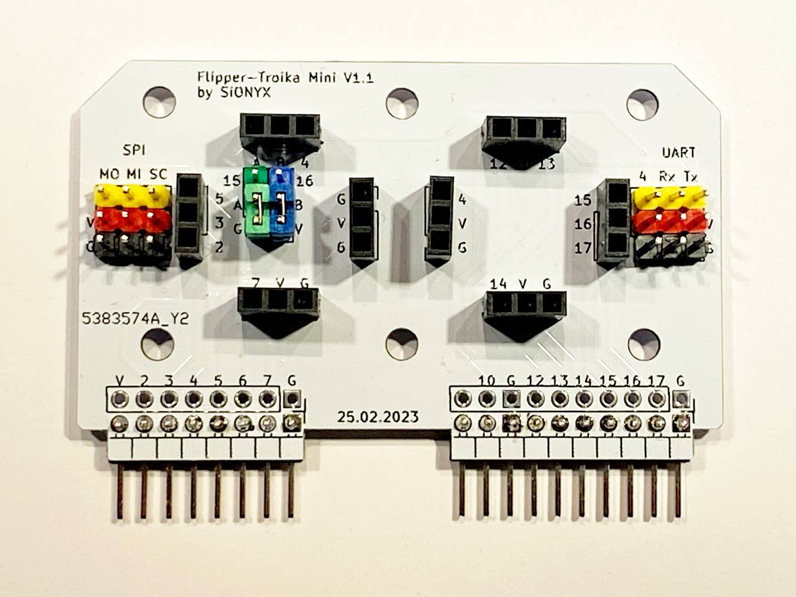
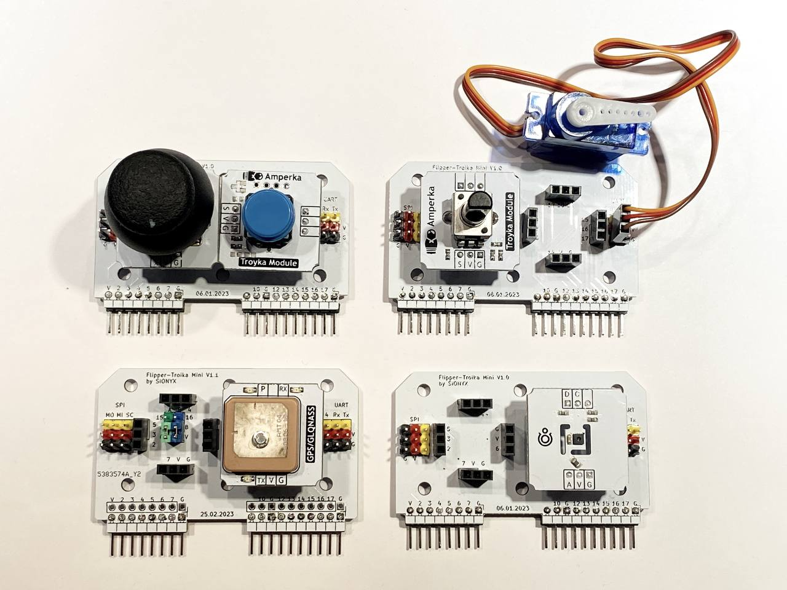
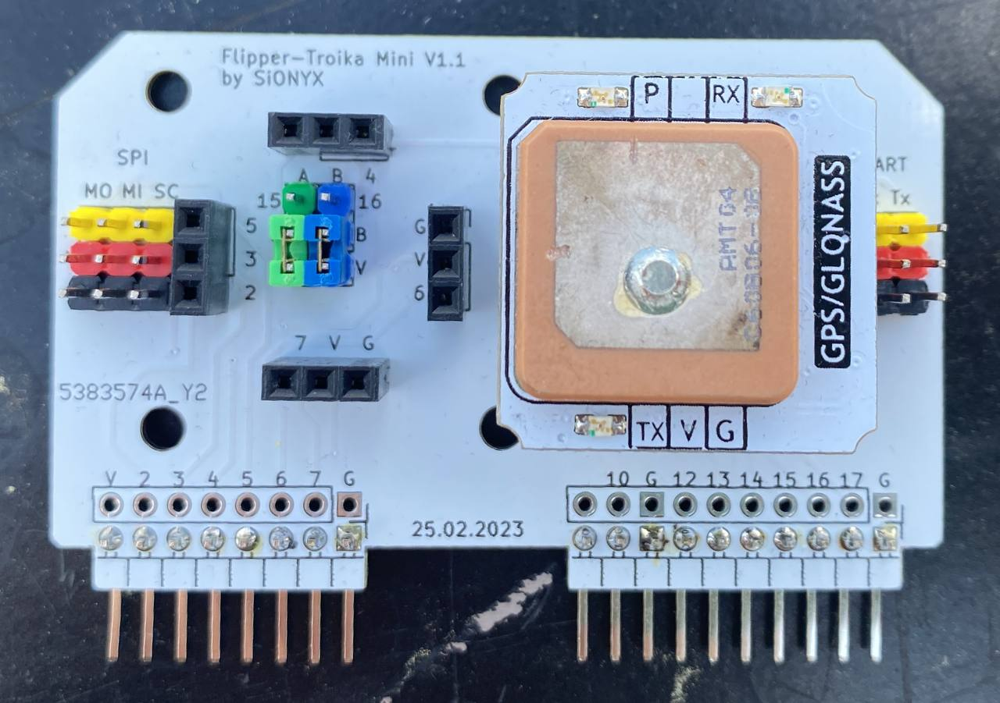

# Flipper-Troika

Плата Flipper-Troika Mini это переходник для подключения модулей [Troyka](https://amperka.ru/collection/troyka) от компании Амперка: платы расширения с типовыми размерами, созданные для удобной сборки и подключения к контроллеру по трём проводам. 

Плата позволяет подключать большинство модулей без дополнительных проводов и использовать напряму с портом расширений Flipper Zero.

⚠️ **Внимание!** Так как модули Тройка изначально проектировались для использования с Arduino, они работают с напряжением 5В. Для совместимости с оригинальными модулями, на плате Flipper-Troika используется выход 5V. *Выход 3V3 не подключен*. Имейте это ввиду, если будете подключать самодельные модули к плате.

⚠️ **Внимание!** Не смотря на то, что на плате Flipper-Troika есть два гнезда для модулей Тройка, подключить беспроводные модули [WiFi](https://amperka.ru/product/troyka-wi-fi) и [Bluetooth](https://amperka.ru/product/troyka-bluetooth-hc-05) не получится.

## Подключаемые модули

### [Приёмник GPS/GLONASS/BDS](https://amperka.ru/product/troyka-gps-glonass)

 

**Схема подключения**:
* Rx -> 13 - Последовательный порт
* Tx -> 14 - Последовательный порт
* V -> V - Питание
* G -> G - Земля

**Приложение для работы**: https://github.com/ezod/flipperzero-gps

**Скачать fap**: https://flipc.org/ezod/flipperzero-gps

## License

Данный текст опубликован под лицензией [CC BY-NC-SA 3.0](https://creativecommons.org/licenses/by-nc-sa/3.0/deed.ru). Вы вправе делиться им, изменять по желанию, при условии ссылки на этот текст или на автора. Вы не можете использовать этот текст в комерческих целях, а так же не можете менять условия лицензирования.
